使用vite构建vue项目：

npm init vite\@latest

***

插值语法中可以使用三元表达式，以及JavaScript语句
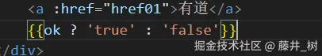
<br>


***

vue中动态参数用\[]包裹，属性名要小写
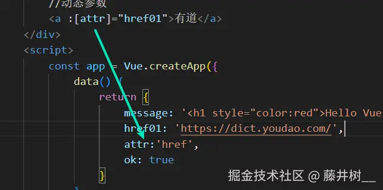

***

\<template>\</template>标签不会被渲染，用于过渡

***

v-for支持输出index索引

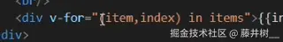

对于字典，使用name表示key

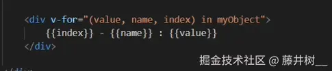

***

导入vue组件
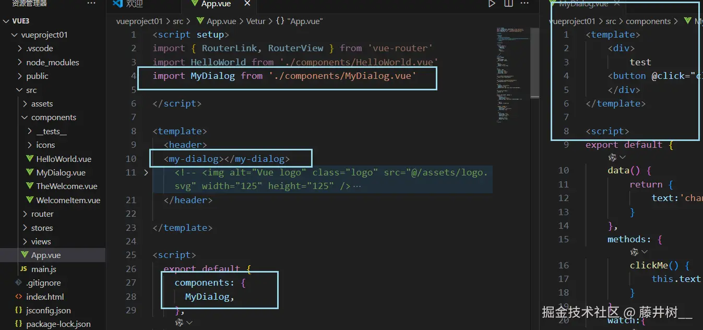

***

自定义插槽
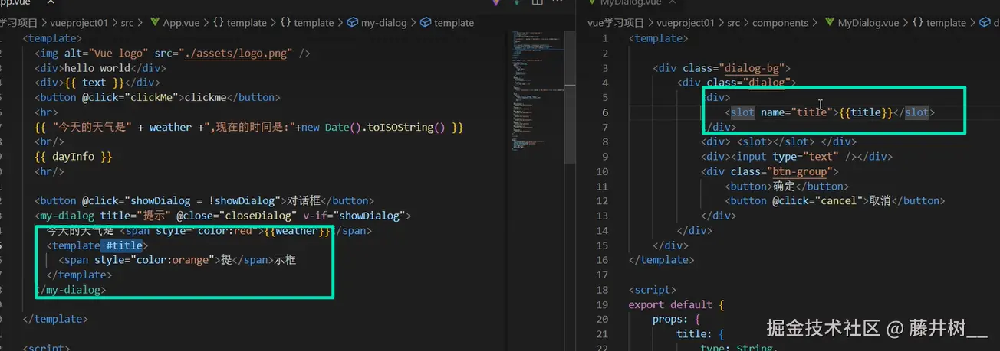

***

具名插槽的用法：
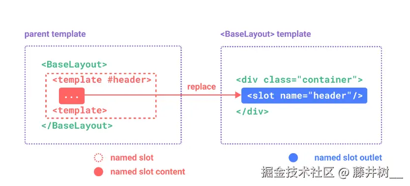
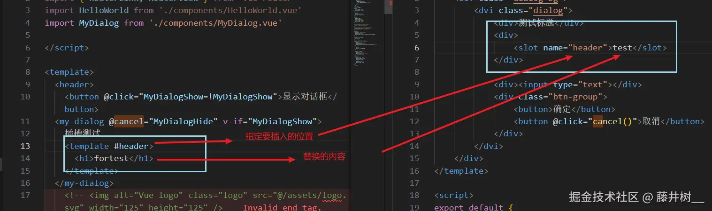

作用域插槽使用的一些对应关系：
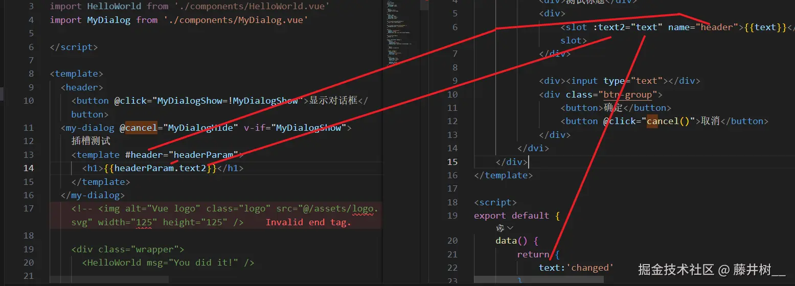

***

使用v-model实时传值
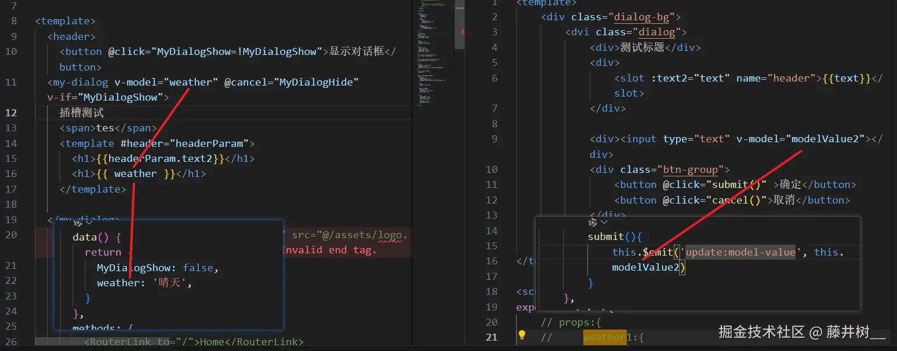

***

v-router路由配置
main.js:
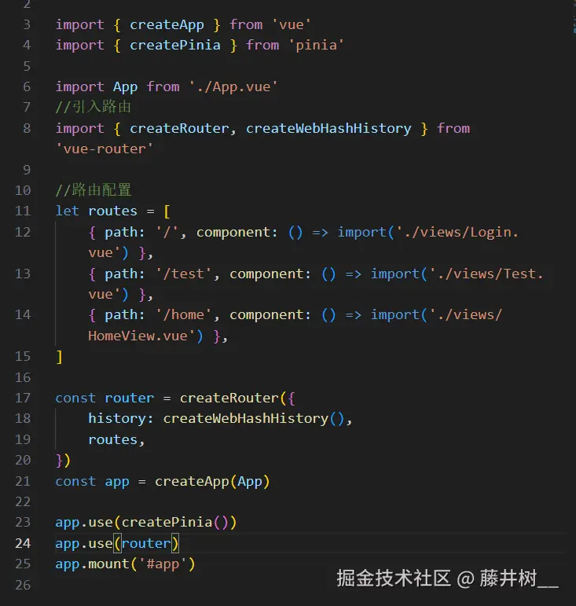
把app.vue内template内的内容改为
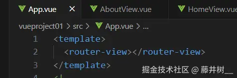

***

在main.js中配置二级路由
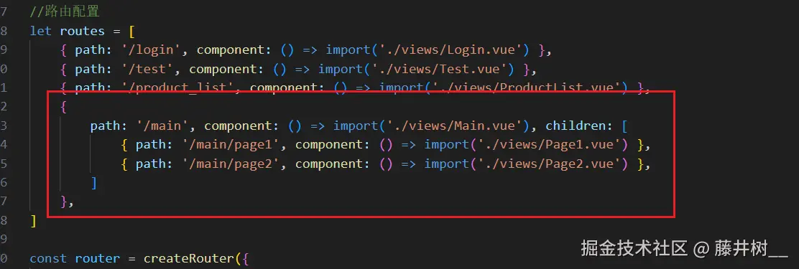

***

\$emit的用法：
子组件：

```
<template>
  <button @click="sendEvent">Click me</button>
</template>

<script>
export default {
  methods: {
    sendEvent() {
      this.$emit('custom-event', 'Hello from ChildComponent!');
    }
  }
}
//this.$emit('custom-event', 'Hello from ChildComponent!') 触发了一个名为 custom-event 的事件
//，并传递了一个字符串参数 'Hello from ChildComponent!'。
</script>

```

父组件：

```
<template>
  <div>
    <ChildComponent @custom-event="handleEvent" />
  </div>
</template>

<script>
import ChildComponent from './ChildComponent.vue';

export default {
  components: {
    ChildComponent
  },
  methods: {
    handleEvent(message) {
      console.log(message); // 输出 'Hello from ChildComponent!'
    }
  }
}
//使用 @custom-event="handleEvent" 监听子组件的 custom-event 事件，
//并调用 handleEvent 方法处理传递过来的数据
</script>

```

总结
\$emit(eventName, payload): 用于在子组件中触发一个事件。eventName 是事件的名称，payload 是可选的参数，用于传递数据给父组件。
父组件通过 @event-name="handlerMethod" 来监听子组件的事件。

***

vue中响应式处理，ref和reactive的区别

    // 使用 ref 创建一个响应式的单一值
        const count = ref(0);

        // 使用 reactive 创建一个响应式对象
        const state = reactive({
          count: 0,
          todos: []
        });

        function incrementCount() {
          count.value++; // 对 ref 值进行操作(需要.value)
          state.count++; // 对 reactive 对象的属性进行操作(不需要.value)
        }

***

组合式api生命周期
生命周期钩子的执行顺序
在Vue 3中，生命周期钩子的执行顺序与Vue 2类似。以组合式API为例：

*   创建阶段:
    *   setup() 函数执行
    *   onBeforeMount 钩子触发
    *   onMounted 钩子触发
*   更新阶段:
    *   数据更新
    *   onBeforeUpdate 钩子触发
    *   DOM更新
    *   onUpdated 钩子触发
*   卸载阶段:
    *   onBeforeUnmount 钩子触发
    *   onUnmounted 钩子触发

***

store中使用storeToRefs保证响应式
let {message,book,testCount} = storeToRefs(counter);

***

使用vite初始化vue项目
在指定目录下使用npm init vite\@latest命令
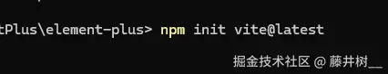

***

vue项目中如果需要设置背景图片的话，背景图片要设置在index.html内
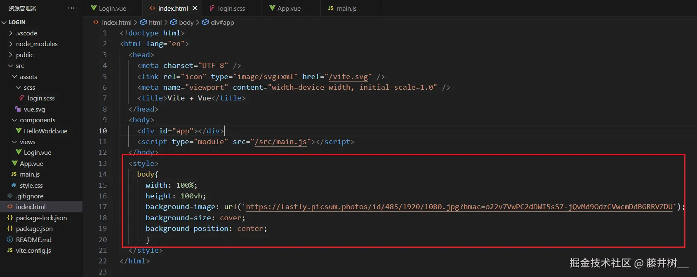

***

vue中需要实时更新的数据（比如登录验证码），在data中返回的地方使用ref（）包裹

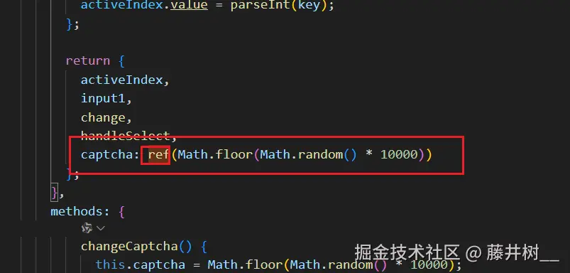

***

vue中引用外部css文件的方法:

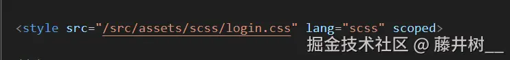

***

pinia<br>
pinia写在js文件中，<br>
其中state（）相当于data（）<br>
actions（）相当于method（）<br>
getter（）则相当于compute（）

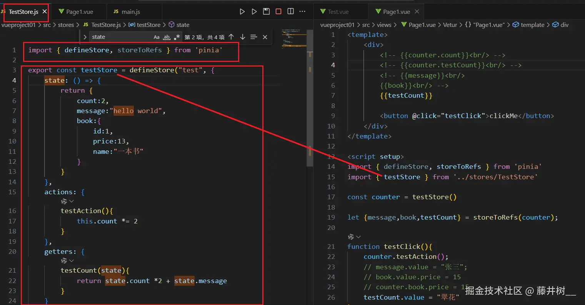
